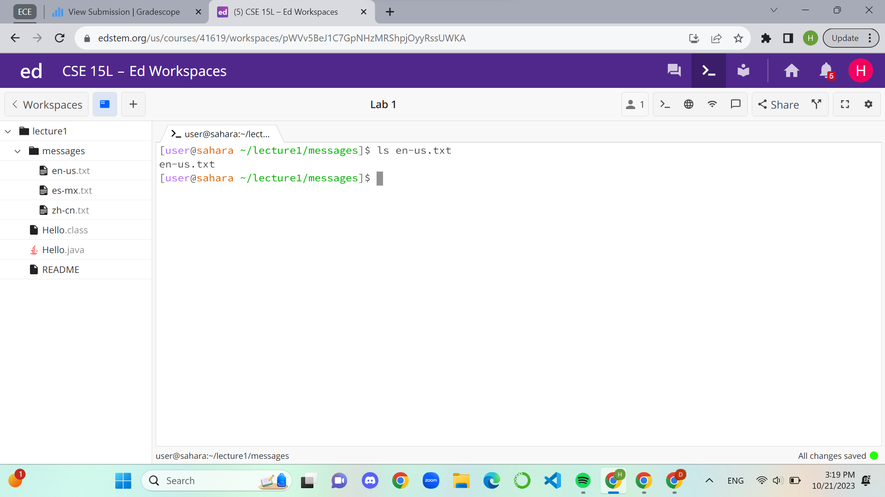
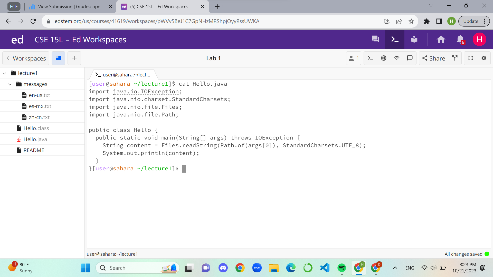

# Lab Report: Week 1, 10/9/2023, 4-6:00 pm
# Hao Tri Luu

---
## **```cd``` Command**
1. The working directory was home. The command with no arguments should return to the home directory (which I was already in), hence, nothing happens. The working directory is the same. No errors.

2. Again, the working directory was home, but this time the command argument included the name of a directory. The directory was a direct subdirectory of home so the command resulted in a change of directory. The new working directory is lecture1. No errors.

3. Again, the working directory was home, but the command argument included the name of a file. This results in a bash message telling me that I cannot change directories since Hello.java is clearly not a directory. That is the error.


---
## **```ls``` Command**
1. The working directory was home. The command lists everything in the directory. Since the command had no argument, the default output is the stuff within the working directory. Hence, it lists lecture1 only since there is a single directory inside home. No errors.

2. Again, the working directory was home. The command and argument included the name of a subdirectory. The result is a list of files and directories of that subdirectory, lecture1. No errors.

3. This time the working directory was messages. The command and argument included the name of a file found directly in the working directory. All it does is output the name of the file. No errors.


---
## **```cat``` Command**
1. The working directory was messages. The command with no argument waits for terminal inputs from the user. After typing some commands, it outputs them. Using ctrl+C allows me to exit out of the command.
![Image]Screenshot 2023-10-21 152039.png)
2. The working directory was home. The command and argument include the name of a subdirectory. The command outputs accordingly, a message telling us that the argument passed is a directory. This is an error because the content of directories cannot be concatenated.

3. This time the working directory was lecture1. The command and argument include the name of a file directly in the working directory. The command reads and prints out the content of the java file, Hello.java. No errors.

