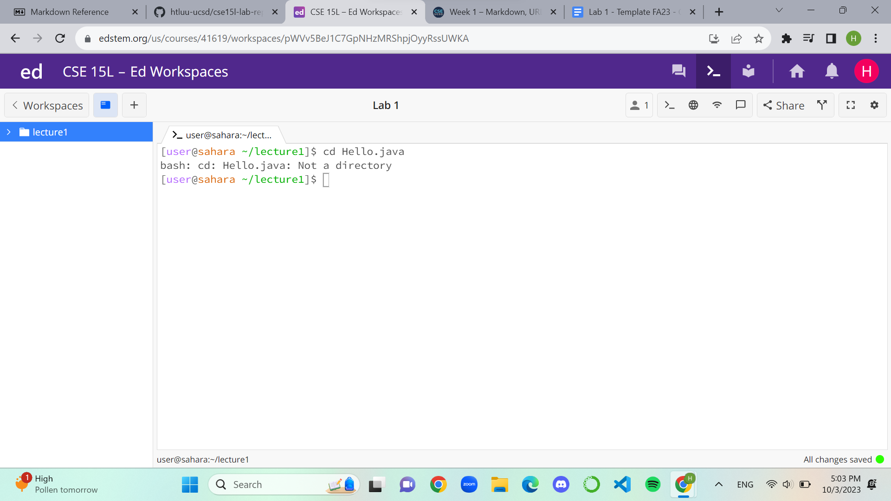

# Lab Report: Week 1, 10/9/2023, 4-6:00 pm
#Hao Tri Luu
---
## **```cd``` Command**
1. The working directory was home. The command with no arguments should return to the home directory (which I was already in), hence, nothing happens. The working directory is the same. No errors.

2. Again, the working directory was home, but this time the command argument included the name of a directory. The directory was a direct subdirectory of home so the command resulted in a change of directory. The new working directory is lecture1. No errors.

3. Again, the working directory was home, but the command argument included the name of a file. This results in a bash message telling me that I cannot change directories since Hello.java is clearly not a directory. That is the error.


---
## **```ls``` Command**
1. The working directory was home. The command lists everything in the directory. Since the command had no argument, the default output is the stuff within the working directory. Hence, it lists lecture1 only since there is a single directory inside home. No errors.

2. Again, the working directory was home. The command and argument included the name of a subdirectory. The result is a list of files and directories of that subdirectory, lecture1. No errors.

3. Again, the working directory was home. The command and argument included the name of a file that is not directly in the working directory. Hello.java is in lecture1 which itself is in home. It is unreachable by the working directory. So it results in an error.


---
## **```cat``` Command**
1. The working directory was home. The command with no argument stops taking terminal inputs and does no output. I tried to clear the terminal but unix commands were unavailable for that reason. Not an error.

2. Again, the working directory is home. The command and argument includes the name of a subdirectory. The command outputs accordingly, a message telling us that the argument passed is a directory. Not an error.

3. Again, the working directory is home. The command and argument includes the name of a file within a subdirectory. As such, it outputs a message saying that there is no file. This is because the file is not directly accessible by the working directory. Not an error.

