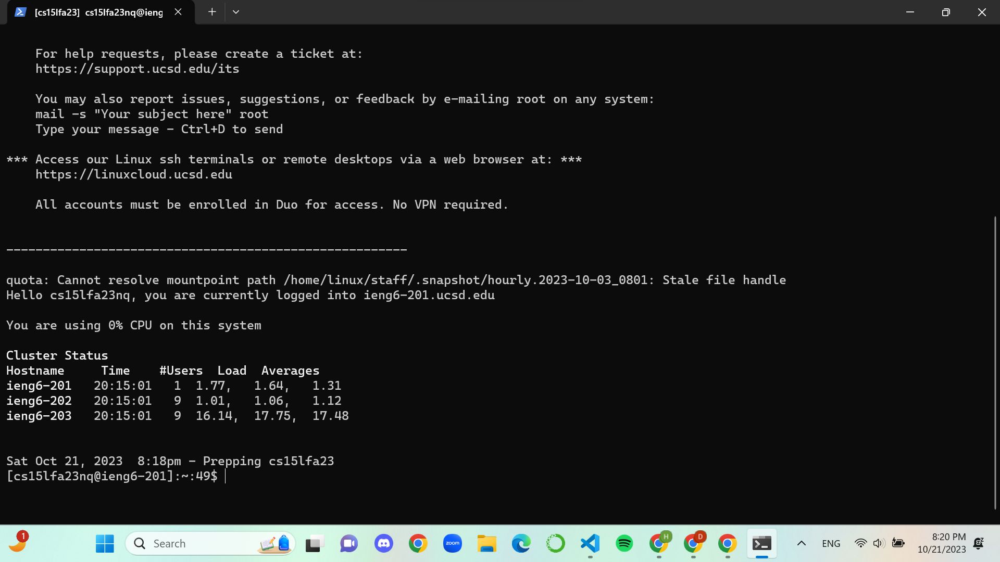

# Lab Report: Week 2, 10/22/2023, 4-6:00 pm
# Hao Tri Luu

---
## Part 1
My code for StringServer.java:


### First add:

- The only method in my code that is called would be handleRequest().
- The relevant argument for the method is the URL. The relevant fields are: wordList, which is what is printed on the webpage, and listNumber, which is for the list number.
- Each of the relevant fields are updated after each method. For listNumber, the int is incremented by 1 so that the list starts at 1. For wordList, the string concatenates listNumber, period, the added string, and the escape sequence to add a new line. The string is 1 line.

### Second add:

- The only method in my code that is called would be handleRequest().
- The relevant argument for the method is the URL. The relevant fields are: wordList, which is what is printed on the webpage, and listNumber, which is for the list number.
- Each of the relevant fields are updated after each method. For listNumber, the int is incremented by 1 so that the list starts at 1 and goes to 2. For wordList, the string concatenates listNumber, period, the added string, and the escape sequence to add a new line. Now the string is 2 lines.

---
## Part 2
## **```ls``` Command**
### Private Key:


### Public Key:


### Login:


---
## Part 3
From weeks 2-3, I learned a lot more about hosting remote servers that I could access from my local device. I knew about "cloud" hosted computers beforehand but I was not aware that I could host my own server and do things remotely and locally together. I also learned to get keys for my local machine so that I would need to type in my password from my main computer.
