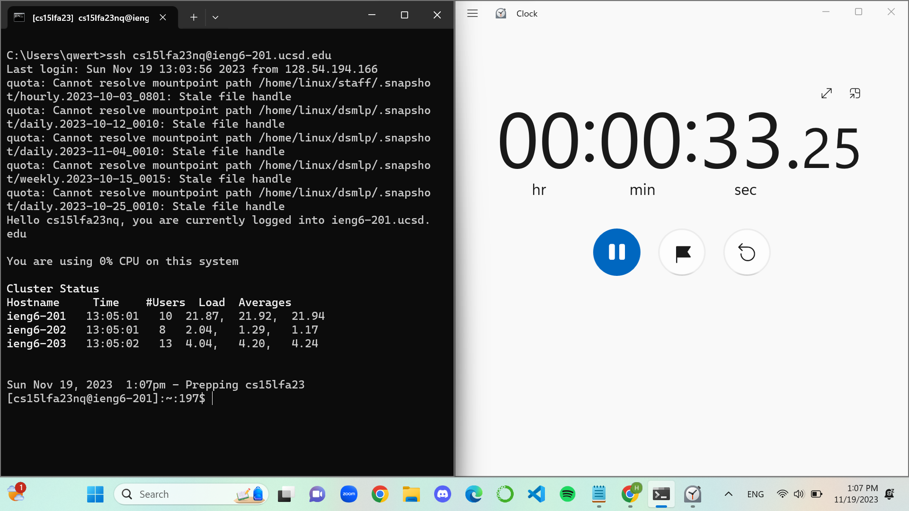
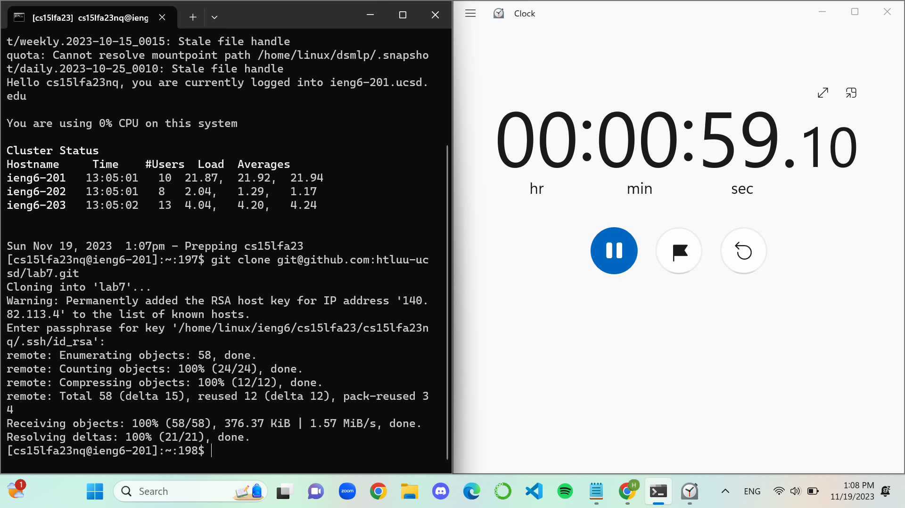
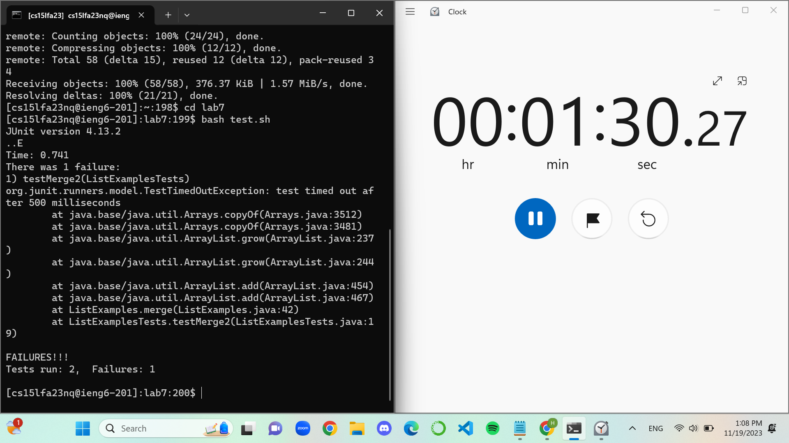
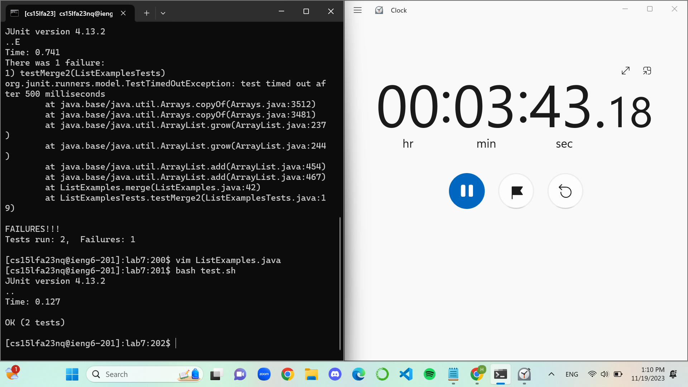
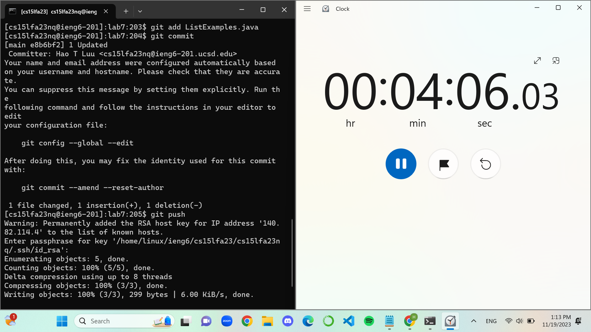

# Lab Report: Week 7, 11/14/2023, 4-6:00 pm
# Hao Tri Luu

---
## Step 4

First, I logged into the remote account using: `ssh <space> cs15lfa23nq@ieng6-201.ucsd.edu <enter>`. Due to the prior weeks, I set up a private key so I didn't need to put my password.

---

## Step 5
Next, I cloned the GitHub repo using: `git <space> clone <space> git@github.com:htluu-ucsd/lab7.git <enter>`.

---
## Step 6
Then, I used `cd <space> lab7 <enter>` to move from my home directory into the correct working directory and tested the bash script by running `bash <space> test.sh <enter>`.

---
## Step 7
After that, I used `vim <space> ListExamples.java <enter>` to open the file to edit. Here, I used the following steps:

- `/index1 <enter>` because I knew the bug-inducing code was the variable named `index1`.
- `<shift> #` because I knew where the bug-inducing code was. It took me to the last occurrence of the variable `index1`.
- `e` because I wanted to change the last index from `index1` to `index2`.
- `x` because I wanted to delete the last character `1`.
- `i2` because I wanted to insert a new character `2`.
- `<esc>` because I was done inserting.
- `:wq <enter>` because I wanted to save and exit the file.

---
## Step 8
Once again, I ran `bash test.sh` which hopefully succeeds this time.

---
## Step 9
Seeing that I worked, I want to commit and push the changes to my repository. So I used `git <space> add <space> ListExamples.java <enter>` to get it into the staging area. Lastly, I used `git <space> commit <enter>` to save my changes and push them into the repository with the command `git <space> push`.

As we can see from my github, the changes were pushed through:

