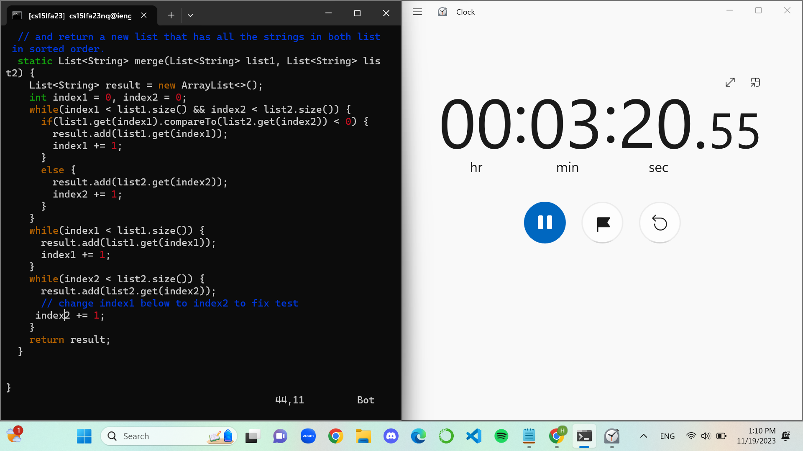

# Lab Report: Week 7, 11/14/2023, 4-6:00 pm
# Hao Tri Luu

---
## Step 4

First, I logged into the remote account by typing in the terminal: `ssh cs15lfa23nq@ieng6-201.ucsd.edu` then pressed `<Enter>` to run the command. Due to the prior weeks, I set up a private key so I didn't need to put my password.

---

## Step 5
Next, I cloned the GitHub repo by typing in the terminal: `git clone git@github.com:htluu-ucsd/lab7.git` then pressed `<Enter>` to run the command.

---
## Step 6
Then, I typed into the terminal `cd lab7` followed by `<Enter>` to run the command and move from my home directory into the correct working directory called `lab7` and tested the bash script by typing: `bash test.sh` then pressing `<Enter>`.

---
## Step 7
After that, I typed into the terminal `vim ListExamples.java` and pressed `<Enter>` to open the file in vim to edit. Here, I used the following steps:

- `/index1 <enter>` because I knew the bug-inducing code was the variable named `index1` and needed to find it.
- `<shift> #` because I knew where the bug-inducing code was. It took me to the last occurrence of the variable `index1`.
- `e` because I wanted to change the last index from `index1` to `index2`.
- `x` because I wanted to delete the last character `1`.
- `i2` because I wanted to insert a new character `2`.
- `<esc>` because I was done inserting.
- `:wq <enter>` because I wanted to save and exit the file (and vim).

---
## Step 8
Once again, I typed into the terminal: `bash test.sh` and pressed `<Enter>` to run the command, which hopefully succeeds this time.

---
## Step 9
Seeing that it worked, I want to commit and push the changes to my repository. So I typed into the terminal: `git add ListExamples.java` then pressed `<Enter>` to get it into the staging area. I now typed into the terminal `git commit` and pressed `<Enter>` to save my changes. Lastly, to push them into the repository, I typed into the terminal: `git push` and pressed `<Enter>` to run the command.

As we can see from my github, the changes were pushed through:

