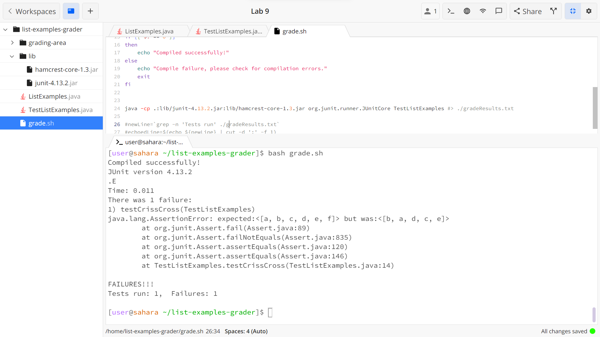
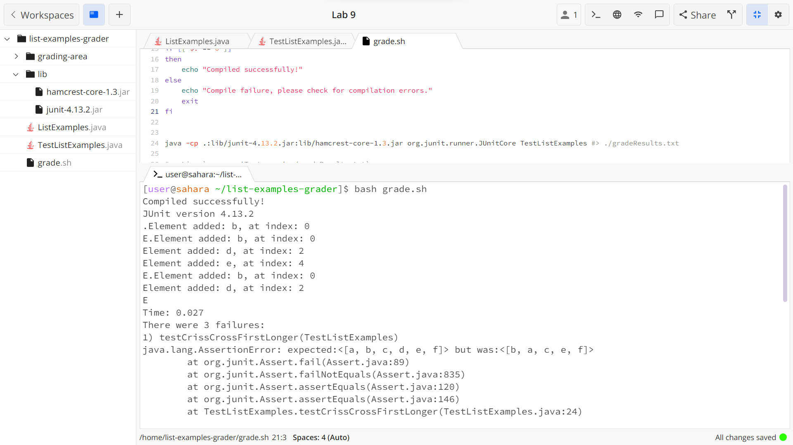
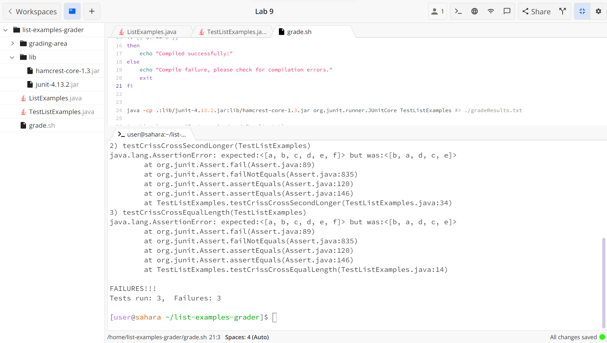
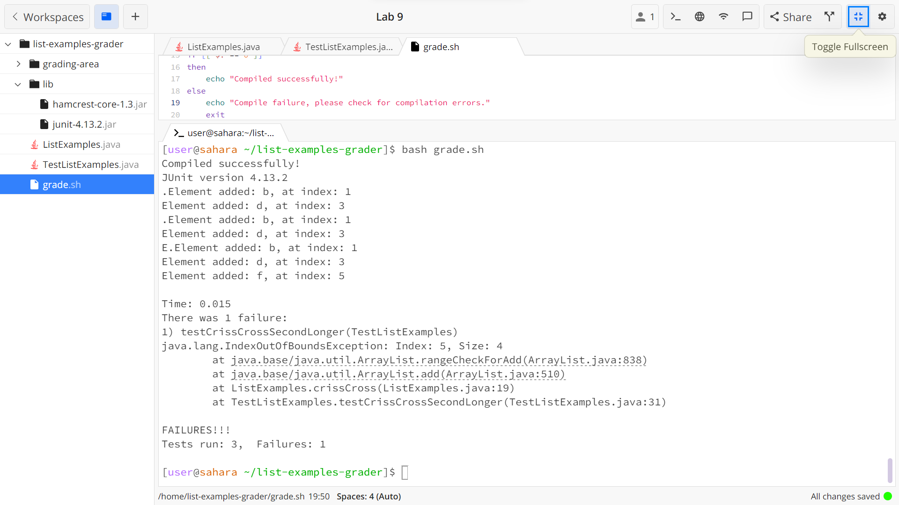
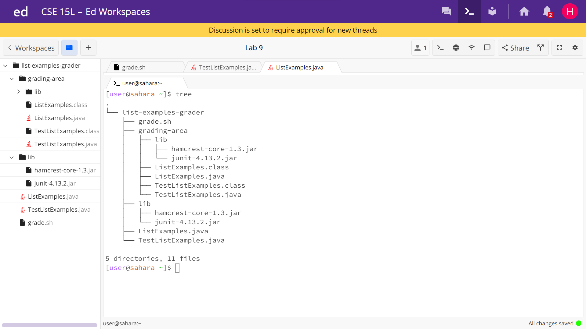

# Lab Report: Week 9, 12/1/2023, 4-6:00 pm
# Hao Tri Luu

---
## Part 1
### Q1. Student question:
Hi, I'm trying to test and correct this implementation of the `crissCross()` method in `ListExamples.java` which takes 2 arraylists then merges them into a new arraylist such that the elements added are alternating, starting with the first index of the first arraylist, then the last index of the second array. Then second element of the first, then second last element of the second. If there are no more elements in one of the arraylists, add the rest of elements to the end. The resulting arraylist does not match the expected.


### Q2. TA Response:
Have you tried testing `merge()` on 2 arrays in all possible scenarios? Where array 1 is longer than 2, where array 2 is longer than 1, and where they're both equal. It may also be advantageous to have multiple `System.out.println()` statements that print the element and their indices. Read the wrong output arraylist carefully and compare to the expectedd and maybe you can identify the issues.

### Q3.
Terminal output of resulting attempt after typing `bash grade.sh` + `<Enter>` into the terminal:

```
Compiled successfully!
JUnit version 4.13.2
.E.E.E
Time: 0.008
There were 3 failures:
1) testCrissCrossFirstLonger(TestListExamples)
java.lang.AssertionError: expected:<[a, b, c, d, e, f]> but was:<[b, a, c, e, f]>
at org.junit.Assert.fail(Assert.java:89)
at org.junit.Assert.failNotEquals(Assert.java:835)
at org.junit.Assert.assertEquals(Assert.java:120)
at org.junit.Assert.assertEquals(Assert.java:146)
at TestListExamples.testCrissCrossFirstLonger(TestListExamples.java:24)
2) testCrissCrossSecondLonger(TestListExamples)
java.lang.AssertionError: expected:<[a, b, c, d, e, f]> but was:<[b, a, d, c, e]>
at org.junit.Assert.fail(Assert.java:89)
at org.junit.Assert.failNotEquals(Assert.java:835)
at org.junit.Assert.assertEquals(Assert.java:120)
at org.junit.Assert.assertEquals(Assert.java:146)
at TestListExamples.testCrissCrossSecondLonger(TestListExamples.java:34)
3) testCrissCrossEqualLength(TestListExamples)
java.lang.AssertionError: expected:<[a, b, c, d, e, f]> but was:<[b, a, d, c, e]>
at org.junit.Assert.fail(Assert.java:89)
at org.junit.Assert.failNotEquals(Assert.java:835)
at org.junit.Assert.assertEquals(Assert.java:120)
at org.junit.Assert.assertEquals(Assert.java:146)
at TestListExamples.testCrissCrossEqualLength(TestListExamples.java:14)

FAILURES!!!
Tests run: 3,  Failures: 3
```



I modified the files `TestListExamples.java` and `ListExamples.java`. The file `TestListExamples.java` has 3 methods `testCrissCrossFirstLonger()`, `testCrissCrossSecondLonger()`, and `testCrissCrossEqualLength()`. Each method will have 4 arraylists, `first`, `second`, `merge`, and `expected`. The 1st method has `first` arraylist with elements `"a", "c", "e", "f"`, `second` arraylist with elements `"d", "b"`; the 2nd method has `first` arraylist with elements `"a", "c"`, `second` arraylist with elements `"f", "e", "d", "b"`; and the 3rd method has `first` arraylist with elements `"a", "c", "e"`, `second` arraylist with elements `"f", "d", "b"`.
The `ListExamples.java` has a new line `System.out.println("Element added: " + list2.get(list2.size() - 1 - i) + ", at index: " + output.indexOf(list2.get(list2.size() - 1 - i)));`, which will print the indices and values of each element to be added to the resulting `merge` arraylist.

I typed `bash grade.sh` + `<Enter>` as mentioned above.
Running the tests, I can see in all 3 methods, the elements of the `second` arraylist are in even indices except for the first element of the `second` arraylist which was not added to the `merge` arraylist at all. Looking specifically at `testCrissCrossEqualLength()`, we see the `merge` arraylist `b, a, d, c, e` and compare it to the `expected` arraylist `a, b, c, d, e, f`. Let me remind you that in `testCrissCrossEqualLength()`, we have `first` arraylist with elements `"a", "c", "e"`, `second` arraylist with elements `"f", "d", "b"`. We can gather that the issue is that the `second` arraylist elements are being inserted into the even indices instead of the odd ones. We also know that the loop that adds the elements of the `second` arraylist is terminating one element short, the element at the first index of `second`.
I then proceed to modify the `ListExamples.java` file at the line: `i < list2.size() - 1` to `i < list2.size()` and at the line `i * 2` to `i * 2 + 1`. More detail for the java files are given at 4 below.


This is a hidden `IndexOutOfBoundsException` bug that could only be found after we addressed the above issues. It was caught in the `testCrissCrossSecondLonger()` method at the method call `crissCross(first, second)`. The last bit of information we find from this is that if the `second` arraylist is longer than the `first`, the elements are being inserted into indices that do not exist.

### Q4. Additional Info
The file structure:
The system and file structure are similar to the one provided in lab. We have the directory `list-examples-grader` where the files are located, the program testing and debugging is taking place, and is the working directory from which we run the bash script. Inside, we have the `lib` subdirectory of `list-examples-grader` where the `hamcrest-core-1.3.jar` and `junit-4.13.2.jar` files are located. These files are necessary to run JUnit tests. Also inside `list-examples-grader` directory, we have the `ListExamples.java` file which is the java project to test and debug, and we have the `TestListExamples.java` file where our JUnit tests are written to test that `ListExamples.java` methods are working as intended. Also inside `list-examples-grader` directory, we have the `grade.sh` bash script that creates the `grading-area` directory within `list-examples-grader` directory; then copies the `lib` directory and both java files into it. The script then compiles and runs the java files. It prints into the terminal, the result of the JUnit test.

I typed `tree` + `<Enter>` in my terminal in the working directory `home` and got the following output:
```
.
└── list-examples-grader
    ├── grade.sh
    ├── grading-area
    │ ├── lib
    │ │ ├── hamcrest-core-1.3.jar
    │ │ └── junit-4.13.2.jar
    │ ├── ListExamples.class
    │ ├── ListExamples.java
    │ ├── TestListExamples.class
    │ └── TestListExamples.java
    ├── lib
    │ ├── hamcrest-core-1.3.jar
    │ └── junit-4.13.2.jar
    ├── ListExamples.java
    └── TestListExamples.java
```

Image of file structure:


### Before fixing bug `ListExamples.java` file:

```
import java.util.ArrayList;
import java.util.List;

class ListExamples {

  static List<String> crissCross(List<String> list1, List<String> list2) {
        List<String> output = new ArrayList<>(); //(list1.size()+list2.size());

        //add elements of list1 to output
        for (String i: list1){
          output.add(i);
        }

        // Insert elements from list2 in reverse order
        for (int i = 0; i < list2.size() - 1; i++) {
            output.add(i * 2, list2.get(list2.size() - 1 - i));
        }

        return output;
  }
}
```

### After fixing first bug but before fixing hidden bug `ListExamples.java` file:

```
import java.util.ArrayList;
import java.util.List;

class ListExamples {

  static List<String> crissCross(List<String> list1, List<String> list2) {
        List<String> output = new ArrayList<>(); //(list1.size()+list2.size());

        //add elements of list1 to output
        for (String i: list1){
          output.add(i);
        }

        // Insert elements from list2 in reverse order
        for (int i = 0; i < list2.size(); i++) {
            output.add(i * 2 + 1, list2.get(list2.size() - 1 - i));
            System.out.println("Element added: " + list2.get(list2.size() - 1 - i) +
                ", at index: " + output.indexOf(list2.get(list2.size() - 1 - i)));
        }

        return output;
  }
}
```


### Before fixing bug `TestListExamples.java` file

```
import static org.junit.Assert.*;
import org.junit.*;
import java.util.Arrays;
import java.util.List;

public class TestListExamples {
  @Test(timeout = 500)
  public void testCrissCross() {
    List<String> first = Arrays.asList("a", "c", "e");
    List<String> second = Arrays.asList("f", "d", "b");
    List<String> merged = ListExamples.crissCross(first, second);
    List<String> expected = Arrays.asList("a", "b", "c", "d", "e", "f");

    assertEquals(expected, merged);
  }
}
```


### Before fixing bug `grade.sh` file:

```
#clears directory from prior use
rm -rf grading-area

#sets up directory for present use
mkdir grading-area

#copies over the java files and directory with jar files to the directory for compiling, testing, and grading
cp *.java ./grading-area
cp ./ListExamples.java ./grading-area
cp -r ./lib ./grading-area

#moves working directory
cd grading-area

#compiles all java files
javac -cp .:lib/hamcrest-core-1.3.jar:lib/junit-4.13.2.jar *.java

#checks if java files compile properly
if [[ $? == 0 ]]
then
    echo "Compiled successfully!"
else
    echo "Compile failure, please check for compilation errors."
    exit
fi

#runs the JUnit tests in TestListExamples.java
java -cp .:lib/junit-4.13.2.jar:lib/hamcrest-core-1.3.jar org.junit.runner.JUnitCore TestListExamples
```

The command I used in the terminal was `bash grade.sh` + `<Enter>` which compiled the java files and ran the JUnit tests in `TestListExamples.java` and printed the result to the terminal.
Within the `TestListExamples.java` file, I had 1 JUnit test initially `testCrissCross()` which had the `first` arraylist with elements `"a", "c", "e"` and the `second` arraylist with elements `"f", "d", "b"`. The `merge` arraylust created a new arraylist that used the `crissCross` method on the `first` and `second` arraylist. The `expected` variable contains the arraylist with the elements in the order I expected. The error was caught by the `assertEquals(expected, merged)` line because the `expected` arraylist has elements `"a", "b", "c", "d", "e", "f"` but the `merge` arraylist has elements `"b", "a", "d", "c", "e"` which do not match and threw an `AssertionError`.

Following the TA suggestion, I modified the `TestListExamples.java` file and added more tests:
```
import static org.junit.Assert.*;
import org.junit.*;
import java.util.Arrays;
import java.util.List;

public class TestListExamples {
  @Test(timeout = 500)
  public void testCrissCrossEqualLength() {
    List<String> first = Arrays.asList("a", "c", "e");
    List<String> second = Arrays.asList("f", "d", "b");
    List<String> merged = ListExamples.crissCross(first, second);
    List<String> expected = Arrays.asList("a", "b", "c", "d", "e", "f");

    assertEquals(expected, merged);
  }

  @Test(timeout = 500)
  public void testCrissCrossFirstLonger() {
    List<String> first = Arrays.asList("a", "c", "e", "f");
    List<String> second = Arrays.asList("d", "b");
    List<String> merged = ListExamples.crissCross(first, second);
    List<String> expected = Arrays.asList("a", "b", "c", "d", "e", "f");

    assertEquals(expected, merged);
  }

  @Test(timeout = 500)
  public void testCrissCrossSecondLonger() {
    List<String> first = Arrays.asList("a", "c");
    List<String> second = Arrays.asList("f", "e", "d", "b");
    List<String> merged = ListExamples.crissCross(first, second);
    List<String> expected = Arrays.asList("a", "b", "c", "d", "e", "f");

    assertEquals(expected, merged);
  }
}
```

Running the `bash grade.sh` in the terminal again, now `testCrissCrossSecondLonger()` catches an issue whereas `testCrissCrossEqualLength()` and `testCrissCrossFirstLonger()` do not catch any issues. The issue in `testCrissCrossSecondLonger()` was that the `first` arraylist had `"a", "c"` elements and the `second` arraylist had `"f", "e", "d", "b"` elements. The issue happened when calling `ListExamples.crissCross(first, second)` which caught an `IndexOutOfBoundsException` exception.


To fix the bug, I had to change 2 lines in the `ListExamples.java` file and add a new conditional. The old code is:

```
for (int i = 0; i < list2.size() - 1; i++) {
    output.add(i * 2, list2.get(list2.size() - 1 - i));
```

changed to the following:
```
for (int i = 0; i < list2.size(); i++) {
    if (output.size() < i * 2 + 1){
        output.add(list2.get(list2.size() - 1 - i));
        continue;
    }
    output.add(i * 2 + 1, list2.get(list2.size() - 1 - I));
    System.out.println("Element added: " + list2.get(list2.size() - 1 - i) +
            ", at index: " + output.indexOf(list2.get(list2.size() - 1 - i)));
```

The first change was changing the range in the `for()` conditional from `i < list2.size() - 1` to `i < list2.size()` because the original was stopping short of one element in the second list. The second change was changing the `i * 2` to `i * 2 + 1` in the second line because the `second` arraylist started inserting with the element at index 0 when it was supposed to start with the element at index 1. The unexpected symptom that appeared after we made the above changes is corrected with a new conditional statement that checks `output.size() < i * 2 + 1` if the index to insert an element into lies outside the range of the output array. If it does, then the elements should just be appended to the end, instead of inserting at an index that does not exist. This goes to show that doing multiple tests are a good measure because we become aware of some bugs only after addressing a different bug. The last line with `System.out.println()` was for testing purposes, to see the elements and indices, and is not needed to get the correct output but was useful for figuring out what went wrong.

The `test.sh` file was unmodified.

---
## Part 2
Something nice and useful that I learned was when in JDB, the `step` command allows me to walk through java code, line by line. This is neat because if I have code in a file that calls code from another file or even library, the command shows me what goes on in those files or library. An example would be if I called a method from an external class in my `main` method in one class. The `step` command will execute the line where that method is called and then go to first line in that called method. This is useful for debugging because I can view the process working instead of just the end result. I found out about this when practicing for Skill Demo 4 because one line of code called a method from a different file and I needed to figure out what variables had what values.
