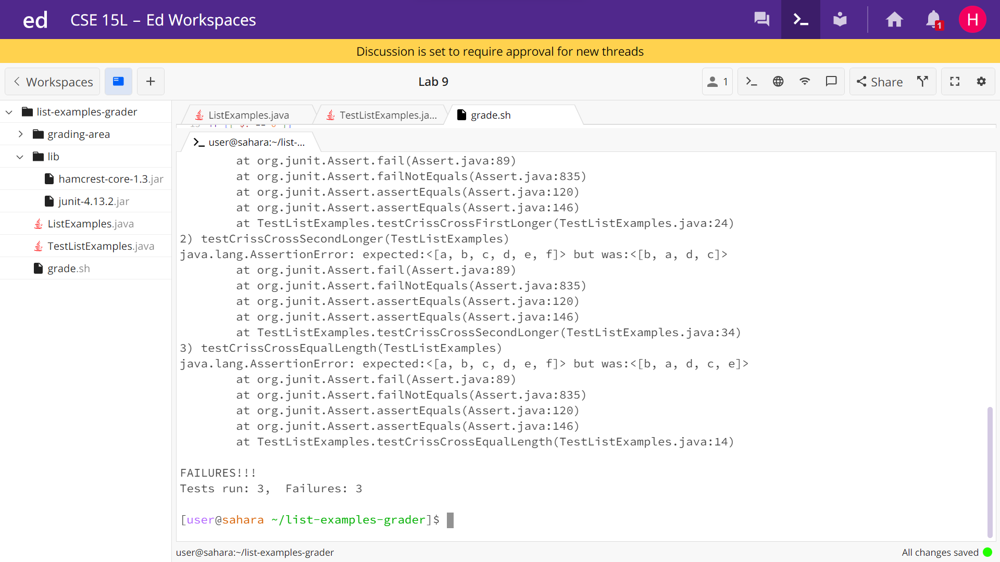

# Lab Report: Week 9, 12/1/2023, 4-6:00 pm
# Hao Tri Luu

---
## Part 1
1. Hi, I'm trying to test and correct this implementation of the `crissCross()` method in `ListExamples.java` which takes 2 arraylists then merges them into a new arraylist such that the elements in the first arraylist are in even indices while the elements in the second arraylist are in the odd indices but in reverse order.


2. Have you tried testing `merge()` on 2 arrays in all possible scenarios? Where array 1 is longer than 2, where array 2 is longer than 1, and where they're both equal. It may also be advantageous to have multiple `System.out.println()` statements that print the element.

3. Terminal output of resulting attempt:


From this information, we can gather that the issue is that the second arraylist elements are being inserted into the even indices instead of the odd ones. We also know that the loop that adds the elements of the second arraylist is terminating one element short.

5.
The system and file structure are similar to the one provided in lab. We have the directory `list-examples-grader` where the files are located, the program testing and debugging is taking place, and is the working directory from which we run the bash script. Inside, we have the `lib` subdirectory of `list-examples-grader` where the `hamcrest-core-1.3.jar` and `junit-4.13.2.jar` files are located. These files are necessary to run JUnit tests. Also inside `list-examples-grader` directory, we have the `ListExamples.java` file which is the java project to test and debug, and we have the `TestListExamples.java` file where our JUnit tests are written to test that `ListExamples.java` methods are working as intended. Also inside `list-examples-grader` directory, we have the `grade.sh` bash script that creates the `grading-area` directory within `list-examples-grader` directory; then copies the `lib` directory and both java files into it. The script then compiles and runs the java files. It prints into the terminal, the result of the JUnit test.

The file structure:


### Before fixing bug `ListExamples.java` file:

```
import java.util.ArrayList;
import java.util.List;

class ListExamples {

  static List<String> crissCross(List<String> list1, List<String> list2) {
        List<String> output = new ArrayList<>(); //(list1.size()+list2.size());

        for (String i: list1){
          output.add(i);
        }

        // Insert elements from list2 in reverse order
        for (int i = 0; i < list2.size() - 1; i++) {
            output.add(i * 2, list2.get(list2.size() - 1 - i));
            //System.out.println("Element added: " + list2.get(list2.size() - 1 - i) + ", at index: " + output.indexOf(list2.get(list2.size() - 1 - i)));
        }

        return output;
  }
}
```

### Befire fixing bug `TestListExamples.java` file

```
import static org.junit.Assert.*;
import org.junit.*;
import java.util.Arrays;
import java.util.List;

public class TestListExamples {
  @Test(timeout = 500)

  public void testCrissCrossEqualLength() {
    List<String> first = Arrays.asList("a", "c", "e");
    List<String> second = Arrays.asList("f", "d", "b");
    List<String> merged = ListExamples.crissCross(first, second);
    List<String> expected = Arrays.asList("a", "b", "c", "d", "e", "f");

    assertEquals(expected, merged);
  }
}
```


### Before fixing bug `grade.sh` file:

```
CPATH='.:lib/hamcrest-core-1.3.jar:lib/junit-4.13.2.jar'

rm -rf grading-area

mkdir grading-area

cp *.java ./grading-area
cp ./ListExamples.java ./grading-area
cp -r ./lib ./grading-area

cd grading-area

javac -cp .:lib/hamcrest-core-1.3.jar:lib/junit-4.13.2.jar *.java

if [[ $? == 0 ]]
then
    echo "Compiled successfully!"
else
    echo "Compile failure, please check for compilation errors."
    exit
fi


java -cp .:lib/junit-4.13.2.jar:lib/hamcrest-core-1.3.jar org.junit.runner.JUnitCore TestListExamples
```

The command I used in the terminal was `bash grade.sh` + `<Enter>` which compiled the java files and ran the JUnit tests in `ListExamples.java` and printed the result to the terminal.

To fix the bug, I had to change 2 lines in the `ListExamples.java` file:

```
for (int i = 0; i < list2.size() - 1; i++) {
    output.add(i * 2, list2.get(list2.size() - 1 - i));
```

to the following:

```
for (int i = 0; i < list2.size(); i++) {
    output.add(i * 2 + 1, list2.get(list2.size() - 1 - i));
```

The first change was changing the range of `list2` from `i < list2.size() - 1` to `i < list2.size()` because the original was stopping short of one element in the second list. The second change was changing the `i * 2` to `i * 2 + 1` in the second line because the former started with the element at index 0 when it was supposed to start with the element at index 1.

None of the other files were modified.

---
## Part 2
Something nice and useful that I learned was when in JDB, the `step` command allows me to walk through java code, line by line. This is neat because if I have code in a file that calls code from another file or even library, the command shows me what goes on in those files or library. An example would be if I called a method from an external class in my `main` method in one class. The `step` command will execute the line where that method is called and then go to first line in that called method. This is useful for debuggin because I can view the process working instead of just the end result. I found out about this when practicing for Skill Demo 4 because one line of code called a method from a different file and I needed to figure out what variables had what values.
